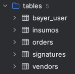
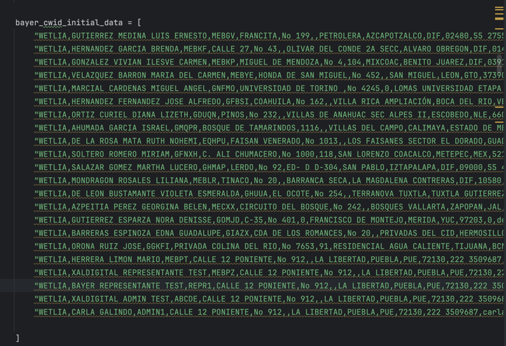

# Xaldigital Insumos App

* **Lenguaje Backend:** Python 3.11
* **Framework Backend:** Flask
* **Plantillas:** Jinja2 y HTMX
* **Frontend:** CSS, Bootstrap5 y Javascript
* **Base de datos:** Postgresql
* **Lógica de la aplicación:** Endpoints de Flask API
* **Authentication:** AWS Cognito con cliente de AWS
* **IoC:** Terraform

Modelos de la Aplicación:

Roles de la aplicación:
* **Administrador:**: Este rol puede ver pedidos, crear y editar insumos y ver las cartas generadas por los repsentantes.
* **Representante:** Este rol puede ver los insumos creados y crear pedidos con insumos seleccionados. Además de esto, puede firmar las cartas con el doctor.

Al desplegar el proyecto se debe ejecutar endpoint en ruta de EC2 generada. Por ejemplo: http://54.205.227.60:5000/initial_data.
Esta petición GET creará todos los modelos de base de datos para empezar a usar la aplicación con los datos iniciales de los representantes provistos por Bayer:

Esta lista tiene roles de administrador y test que pueden ser creados usando CWIDs que autocompletarán los datos en el registro de la aplicación.

Los endpoints el registro e ingreso a la aplicación funcionan para los 2 roles:
* **Registro:**: /registro
* **Login:** /login

Los usuarios tienen reglas en donde cada rol solo puede ver las acciones habilitadas para ese rol. Por lo tanto, un representante no podrá ejecutar ni ver las acciones de un administrador.

Las firmas de la aplicación y generación de PDF se hacen con Javascript.
